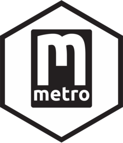

<!-- README.md is generated from README.Rmd. Please edit that file -->

```{r, include = FALSE}
knitr::opts_chunk$set(
  collapse = TRUE,
  warning = FALSE,
  message = FALSE,
  error = FALSE,
  comment = "#>",
  fig.path = "man/figures/README-",
  fig.height = 4,
  fig.width = 9,
  out.width = "100%",
  dpi = 300
)
if (!interactive()) {
  options(width = 95)
}
```

# metro 

<!-- badges: start -->
[![Lifecycle: experimental][life_badge]][life_link]
[![CRAN status][cran_badge]][cran_link]
![Downloads][dl_badge]
[![Codecov test coverage][cov_badge]][cov_link]
[![R build status][ga_badge]][ga_link]
<!-- badges: end -->

The goal of metro is to return data frames from the Washington Metropolitan Area
Transit Authority API. Nested lists have been converted to [tidy] data frames
when possible.

## Installation

The release version of metro (0.9.1) can be installed from [CRAN][cran]:

```{r install_cran, eval=FALSE}
install.packages("metro")
```

Or install the development version from [GitHub][gh]:

```{r install_github, eval=FALSE}
# install.packages("devtools")
devtools::install_github("kiernann/metro")
```

## Key

Usage of the WMATA API requires a developer API key. Such a key can be obtained
by creating a developer account and subscribing to the free default tier.

The WMATA also provides a [demo key][demo] to try out the various features of
the API. This key should **never** be used in production, it is rate limited and
subject to change at any time.

```{r key}
Sys.setenv(WMATA_KEY = "e13626d03d8e4c03ac07f95541b3091b")
```

## Example

```{r library}
library(metro)
packageVersion("metro")
```

Functions return data frames for easy analysis.

```{r rail_stations}
next_train(StationCodes = "A01")
```

### Coordinates

Use coordinates to find station entrances or bus stops near a location. The
[`geodist::geodist()`][gd] function is used to calculate distance from the
supplied coordinates.

```{r rail_entrance}
# Washington Monument coordinates
rail_entrance(Lat = 38.890, Lon = -77.035, Radius = 750)[, -(3:4)]
```

### Dates and Times

Date columns with class `POSIXt` have been shifted from Eastern time to the UTC
time zone (+5 hours).

```{r bus_position}
bus_position(RouteId = "33")[, 1:8]
```

Time values are left in Eastern time and are represented using the class
[`hms`][hms], which counts the seconds since midnight. If the _last_ train on a
Saturday leaves at 1:21 AM (past midnight), this would be represented as
`25:21`.

```{r rail_times}
tail(rail_times(StationCode = "E10"))
```

### Data

Some data frames are includes as objects if their functions typically return the
same thing every time.

```{r lines}
metro_lines # rail_lines() for live
```

<!-- refs: start -->
[life_badge]: https://img.shields.io/badge/lifecycle-stable-green
[life_link]: https://lifecycle.r-lib.org/articles/stages.html#stable
[cran_badge]: https://www.r-pkg.org/badges/version/metro
[cran_link]: https://CRAN.R-project.org/package=metro
[ga_badge]: https://github.com/kiernann/metro/workflows/R-CMD-check/badge.svg
[ga_link]: https://github.com/kiernann/metro/actions
[cov_badge]: https://img.shields.io/codecov/c/github/kiernann/metro/master.svg
[cov_link]: https://app.codecov.io/gh/kiernann/metro?branch=master'
[dl_badge]: https://cranlogs.r-pkg.org/badges/grand-total/gluedown
[tidy]: https://en.wikipedia.org/wiki/Tidy_data
[cran]: https://cran.r-project.org/package=metro
[gh]: https://github.com/kiernann/metro
[demo]: https://developer.wmata.com/products/5475f236031f590f380924ff
[gd]: https://github.com/hypertidy/geodist
[hms]: https://github.com/tidyverse/hms
<!-- refs: end -->
